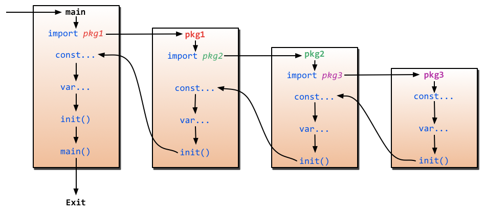

[TOC]

# Go

## 1、环境配置

## 2、 Go语言基础

### 2.1、helloworld

> Go使用`package`（和Python的模块类似）来组织代码。`main.main()`函数(这个函数位于主包）是每一个独立的可运行程序的入口点。Go使用UTF-8字符串和标识符(因为UTF-8的发明者也就是Go的发明者之一)，所以它天生支持多语言。 

```go
package main

import "fmt"

func main() {
	fmt.Printf("Hello, world or 你好，世界 or καλημ ́ρα κóσμ or こんにちはせかい\n")
}
```

[Go语言标准库文档中文版]("https://studygolang.com/pkgdoc")


 ### 2.2、Go基础

#### 定义变量

- 定义一个变量

  ```go
  //定义一个名称为“variableName”，类型为"type"的变量
  var variableName type
  ```

- 定义多个变量

  ```go
  //定义三个类型都是“type”的变量
  var vname1, vname2, vname3 type
  ```

- 定义变量并初始化值

  ```go
  //初始化“variableName”的变量为“value”值，类型是“type”
  var variableName type = value
  ```

- 同时初始化多个变量

  ```go
  /*
  	定义三个类型都是"type"的变量,并且分别初始化为相应的值
  	vname1为v1，vname2为v2，vname3为v3
  */
  var vname1, vname2, vname3 type= v1, v2, v3
  ```

- 简化

  ```go
  /*
  	定义三个变量，它们分别初始化为相应的值
  	vname1为v1，vname2为v2，vname3为v3
  	然后Go会根据其相应值的类型来帮你初始化它们
  */
  var vname1, vname2, vname3 = v1, v2, v3
  ```

- “  **:=** ”运算符

  ```go
  /*
  	定义三个变量，它们分别初始化为相应的值
  	vname1为v1，vname2为v2，vname3为v3
  	编译器会根据初始化的值自动推导出相应的类型
  */
  vname1, vname2, vname3 := v1, v2, v3
  ```

  >  ***\*:=\** 左侧如果没有声明新的变量，就产生编译错误，例如：** 

  ```go
  var intVal int 
  
  intVal :=1 // 这时候会产生编译错误
  
  intVal,intVal1 := 1,2 // 此时不会产生编译错误，因为有声明新的变量，因为 := 是一个声明语句
  ```


#### 常量

> 所谓常量，也就是在程序编译阶段就确定下来的值，而程序在运行时无法改变该值。在Go程序中，常量可定义为数值、布尔值或字符串等类型。
>
> 它的语法如下：

```go
const constantName = value
//如果需要，也可以明确指定常量的类型：
const Pi float32 = 3.1415926
```

#### 内置基础类型

```GO
bool
string
int  int8  int16  int32  int64
uint uint8 uint16 uint32 uint64 uintptr
byte // uint8 的别名
rune // int32 的别名
    // 表示一个 Unicode 码点
float32 float64
complex64 complex128
```


##### Boolean

>  在Go中，布尔值的类型为`bool`，值是`true`或`false`，默认为`false`。 

```go
//示例代码
var isActive bool  // 全局变量声明
var enabled, disabled = true, false  // 忽略类型的声明
func test() {
	var available bool  // 一般声明
	valid := false      // 简短声明
	available = true    // 赋值操作
}
```


##### 数值类型

 整数类型有无符号和带符号两种。Go同时支持`int`和`uint`，这两种类型的长度相同，但具体长度取决于不同编译器的实现。Go里面也有直接定义好位数的类型：`rune`, `int8`, `int16`, `int32`, `int64`和`byte`, `uint8`, `uint16`, `uint32`, `uint64`。其中`rune`是`int32`的别称，`byte`是`uint8`的别称。 

> 需要注意的一点是，这些类型的变量之间不允许互相赋值或操作，不然会在编译时引起编译器报错。
>
> 如下的代码会产生错误：invalid operation: a + b (mismatched types int8 and int32)
>
> > var a int8

> > var b int32

> > c:=a + b  // 错误
> >
> > c := int8(b) + a // 正确
>
> 另外，尽管int的长度是32 bit, 但int 与 int32并不可以互用。

浮点数的类型有`float32`和`float64`两种（没有`float`类型），默认是`float64`。

```go
num := .123 // => 0.123
// 科学计数法
num := 5.12e2 // => 5.12 * 10^2
num11 := 3.12e-2 // => 3.12 * 10^-2
```


这就是全部吗？No！Go还支持复数。它的默认类型是`complex128`（64位实数+64位虚数）。如果需要小一些的，也有`complex64`(32位实数+32位虚数)。复数的形式为`RE + IMi`，其中`RE`是实数部分，`IM`是虚数部分，而最后的`i`是虚数单位。下面是一个使用复数的例子：

```go
var c complex64 = 5+5i
//output: (5+5i)
fmt.Printf("Value is: %v", c)
```


##### 字符串

 Go中的字符串都是采用`UTF-8`字符集编码。字符串是用一对双引号（`""`）或反引号（``` ```）括起来定义，它的类型是`string`。 

```go
//示例代码
var frenchHello string  // 声明变量为字符串的一般方法
var emptyString string = ""  // 声明了一个字符串变量，初始化为空字符串
func test() {
	no, yes, maybe := "no", "yes", "maybe"  // 简短声明，同时声明多个变量
	japaneseHello := "Konichiwa"  // 同上
	frenchHello = "Bonjour"  // 常规赋值
}
```

 在Go中字符串是不可变的，例如下面的代码编译时会报错：cannot assign to s[0] 

```go
var s string = "hello"
s[0] = 'c'
```

 但如果真的想要修改怎么办呢？下面的代码可以实现： 

```go
s := "hello"
c := []byte(s)  // 将字符串 s 转换为 []byte 类型
c[0] = 'c'
s2 := string(c)  // 再转换回 string 类型
fmt.Printf("%s\n", s2)
```

 Go中可以使用`+`操作符来连接两个字符串： 

```go
s := "hello,"
m := " world"
a := s + m
fmt.Printf("%s\n", a)
```

修改字符串也可写为：

```go
s := "hello"
s = "c" + s[1:] // 字符串虽不能更改，但可进行切片操作
fmt.Printf("%s\n", s)
```

如果要声明一个多行的字符串怎么办？可以通过```来声明：

```go
m := `hello
	world`
```

\``` 括起的字符串为Raw字符串，即字符串在代码中的形式就是打印时的形式，它没有字符转义，换行也将原样输出。例如本例中会输出：

```go
hello
	world
```


##### 错误类型

Go内置有一个`error`类型，专门用来处理错误信息，Go的`package`里面还专门有一个包`errors`来处理错误：

```go
err := errors.New("emit macho dwarf: elf header corrupted")
if err != nil {
	fmt.Print(err)
}
```


#### 一些技巧

##### 分组声明

在Go语言中，同时声明多个常量、变量，或者导入多个包时，可采用分组的方式进行声明。

例如下面的代码：

```go
import "fmt"
import "os"

const i = 100
const pi = 3.1415
const prefix = "Go_"

var i int
var pi float32
var prefix string
```

可以分组写成如下形式：

```go
import(
	"fmt"
	"os"
)

const(
	i = 100
	pi = 3.1415
	prefix = "Go_"
)

var(
	i int
	pi float32
	prefix string
)
```


##### iota枚举

Go里面有一个关键字`iota`，这个关键字用来声明`enum`的时候采用，它默认开始值是0，const中每增加一行加1：

```go
package main

import (
	"fmt"
)

const (
	x = iota // x == 0
	y = iota // y == 1
	z = iota // z == 2
	w        // 常量声明省略值时，默认和之前一个值的字面相同。这里隐式地说w = iota，因此w == 3。其实上面y和z可同样不用"= iota"
)

const v = iota // 每遇到一个const关键字，iota就会重置，此时v == 0

const (
	h, i, j = iota, iota, iota //h=0,i=0,j=0 iota在同一行值相同
)

const (
	a       = iota //a=0
	b       = "B"
	c       = iota             //c=2
	d, e, f = iota, iota, iota //d=3,e=3,f=3
	g       = iota             //g = 4
)

func main() {
	fmt.Println(a, b, c, d, e, f, g, h, i, j, x, y, z, w, v)
}
```

> 除非被显式设置为其它值或`iota`，每个`const`分组的第一个常量被默认设置为它的0值，第二及后续的常量被默认设置为它前面那个常量的值，如果前面那个常量的值是`iota`，则它也被设置为`iota`。


##### Go程序设计的一些规则

Go之所以会那么简洁，是因为它有一些默认的行为：

- 大写字母开头的变量是可导出的，也就是其它包可以读取的，是公有变量；小写字母开头的就是不可导出的，是私有变量。
- 大写字母开头的函数也是一样，相当于`class`中的带`public`关键词的公有函数；小写字母开头的就是有`private`关键词的私有函数。


#### builtin


```go
func new(Type) *Type
```

用来分配内存，主要用来分配值类型，比如int,float,struct...返回的是指针

```go
func make(Type, size IntegerType) Type
```

内建函数==**make**==分配并初始化一个类型为切片、map或通道的对象。其第一个实参为类型，而非值。make得返回类型与其参数相同，而非指向它得指针。其具体结果取决于具体得类型。

slice：size指定了其长度。该切片的容量等于其长度。切片支持第二个整数实参可用来指定不同的容量；但是第二个整数值必须不小于第一个整数值。
map：初始分配的创建取决于size，但产生的映射长度为0。size可以省略，实际上，对于map来说，size不管是多少，为map分配长度都为0。
chan：通道的缓存根据指定的缓存容量初始化。若size为零或被省略，该信道即为无缓存的。


#### array、slice、map

##### array

 `array`就是数组，它的定义方式如下： 

```go
var arr [n]type
```

在`[n]type`中，`n`表示数组的长度，`type`表示存储元素的类型。对数组的操作和其它语言类似，都是通过`[]`来进行读取或赋值：

```go
var arr [10]int  // 声明了一个int类型的数组
arr[0] = 42      // 数组下标是从0开始的
arr[1] = 13      // 赋值操作
fmt.Printf("The first element is %d\n", arr[0])  // 获取数据，返回42
fmt.Printf("The last element is %d\n", arr[9]) //返回未赋值的最后一个元素，默认返回0
```

由于长度也是数组类型的一部分，因此`[3]int`与`[4]int`是不同的类型，数组也就不能改变长度。数组之间的赋值是值的赋值，即当把一个数组作为参数传入函数的时候，传入的其实是该数组的副本，而不是它的指针。如果要使用指针，那么就需要用到后面介绍的`slice`类型了。

数组可以使用另一种`:=`来声明

```go
a := [3]int{1, 2, 3} // 声明了一个长度为3的int数组

b := [10]int{1, 2, 3} // 声明了一个长度为10的int数组，其中前三个元素初始化为1、2、3，其它默认为0

c := [...]int{4, 5, 6} // 可以省略长度而采用`...`的方式，Go会自动根据元素个数来计算长度
```

也许你会说，我想数组里面的值还是数组，能实现吗？当然咯，Go支持嵌套数组，即多维数组。比如下面的代码就声明了一个二维数组：

```go
// 声明了一个二维数组，该数组以两个数组作为元素，其中每个数组中又有4个int类型的元素
doubleArray := [2][4]int{[4]int{1, 2, 3, 4}, [4]int{5, 6, 7, 8}}

// 上面的声明可以简化，直接忽略内部的类型
easyArray := [2][4]int{{1, 2, 3, 4}, {5, 6, 7, 8}}
```


##### slice

在很多应用场景中，数组并不能满足我们的需求。在初始定义数组时，我们并不知道需要多大的数组，因此我们就需要“动态数组”。在Go里面这种数据结构叫`slice`

`slice`并不是真正意义上的动态数组，而是一个引用类型。`slice`总是指向一个底层`array`，`slice`的声明也可以像`array`一样，只是不需要长度。

```go
// 和声明array一样，只是少了长度
var fslice []int
```

接下来我们可以声明一个`slice`，并初始化数据，如下所示：

```go
slice := []byte {'a', 'b', 'c', 'd'}
```

`slice`可以从一个数组或一个已经存在的`slice`中再次声明。`slice`通过`array[i:j]`来获取，其中`i`是数组的开始位置，`j`是结束位置，但不包含`array[j]`，它的长度是`j-i`。

```go
// 声明一个含有10个元素元素类型为byte的数组
var ar = [10]byte {'a', 'b', 'c', 'd', 'e', 'f', 'g', 'h', 'i', 'j'}

// 声明两个含有byte的slice
var a, b []byte

// a指向数组的第3个元素开始，并到第五个元素结束，
a = ar[2:5]
//现在a含有的元素: ar[2]、ar[3]和ar[4]

// b是数组ar的另一个slice
b = ar[3:5]
// b的元素是：ar[3]和ar[4]
```

> 注意`slice`和数组在声明时的区别：声明数组时，方括号内写明了数组的长度或使用`...`自动计算长度，而声明`slice`时，方括号内没有任何字符。

slice有一些简便的操作

- `slice`的默认开始位置是0，`ar[:n]`等价于`ar[0:n]`
- `slice`的第二个序列默认是数组的长度，`ar[n:]`等价于`ar[n:len(ar)]`
- 如果从一个数组里面直接获取`slice`，可以这样`ar[:]`，因为默认第一个序列是0，第二个是数组的长度，即等价于`ar[0:len(ar)]`

下面这个例子展示了更多关于`slice`的操作：

```go
// 声明一个数组
var array = [10]byte{'a', 'b', 'c', 'd', 'e', 'f', 'g', 'h', 'i', 'j'}
// 声明两个slice
var aSlice, bSlice []byte

// 演示一些简便操作
aSlice = array[:3] // 等价于aSlice = array[0:3] aSlice包含元素: a,b,c
aSlice = array[5:] // 等价于aSlice = array[5:10] aSlice包含元素: f,g,h,i,j
aSlice = array[:]  // 等价于aSlice = array[0:10] 这样aSlice包含了全部的元素

// 从slice中获取slice
aSlice = array[3:7]  // aSlice包含元素: d,e,f,g，len=4，cap=7
bSlice = aSlice[1:3] // bSlice 包含aSlice[1], aSlice[2] 也就是含有: e,f
bSlice = aSlice[:3]  // bSlice 包含 aSlice[0], aSlice[1], aSlice[2] 也就是含有: d,e,f
bSlice = aSlice[0:5] // 对slice的slice可以在cap范围内扩展，此时bSlice包含：d,e,f,g,h
bSlice = aSlice[:]   // bSlice包含所有aSlice的元素: d,e,f,g
```

`slice`是引用类型，所以当引用改变其中元素的值时，其它的所有引用都会改变该值，例如上面的`aSlice`和`bSlice`，如果修改了`aSlice`中元素的值，那么`bSlice`相对应的值也会改变。

从概念上面来说`slice`像一个结构体，这个结构体包含了三个元素：

- 一个指针，指向数组中`slice`指定的开始位置
- 长度，即`slice`的长度
- 最大长度，也就是`slice`开始位置到数组的最后位置的长度

```go
	Array_a := [10]byte{'a', 'b', 'c', 'd', 'e', 'f', 'g', 'h', 'i', 'j'}
	Slice_a := Array_a[2:5]
```

对于`slice`有几个有用的内置函数：

- `len` 获取`slice`的长度
- `cap` 获取`slice`的最大容量
- `append` 向`slice`里面追加一个或者多个元素，然后返回一个和`slice`一样类型的`slice`
- `copy` 函数`copy`从源`slice`的`src`中复制元素到目标`dst`，并且返回复制的元素的个数

注：`append`函数会改变`slice`所引用的数组的内容，从而影响到引用同一数组的其它`slice`。 但当`slice`中没有剩余空间（即`(cap-len) == 0`）时，此时将动态分配新的数组空间。返回的`slice`数组指针将指向这个空间，而原数组的内容将保持不变；其它引用此数组的`slice`则不受影响。

从Go1.2开始slice支持了三个参数的slice，之前我们一直采用这种方式在slice或者array基础上来获取一个slice

```go
var array [10]int
slice := array[2:4]
```

这个例子里面slice的容量是8，新版本里面可以指定这个容量

```go
slice = array[2:4:7]
```

上面这个的容量就是`7-2`，即5。这样这个产生的新的slice就没办法访问最后的三个元素。

如果slice是这样的形式`array[:i:j]`，即第一个参数为空，默认值就是0。


##### map

>  map`也就是Python中字典的概念，它的格式为`map[keyType]valueType

我们看下面的代码，`map`的读取和设置也类似`slice`一样，通过`key`来操作，只是`slice`的`index`只能是`int`类型，而`map`多了很多类型，可以是`int`，可以是`string`及所有完全定义了`==`与`!=`操作的类型。

```go
// 声明一个key是字符串，值为int的字典,这种方式的声明需要在使用之前使用make初始化
var numbers map[string]int
// 另一种map的声明方式
numbers = make(map[string]int)
numbers["one"] = 1  //赋值
numbers["ten"] = 10 //赋值
numbers["three"] = 3

fmt.Println("第三个数字是: ", numbers["three"]) // 读取数据
// 打印出来如:第三个数字是: 3
```

这个`map`就像我们平常看到的表格一样，左边列是`key`，右边列是值

使用map过程中需要注意的几点：

- `map`是无序的，每次打印出来的`map`都会不一样，它不能通过`index`获取，而必须通过`key`获取
- `map`的长度是不固定的，也就是和`slice`一样，也是一种引用类型
- 内置的`len`函数同样适用于`map`，返回`map`拥有的`key`的数量
- `map`的值可以很方便的修改，通过`numbers["one"]=11`可以很容易的把key为`one`的字典值改为`11`
- `map`和其他基本型别不同，它不是thread-safe，在多个go-routine存取时，必须使用mutex lock机制

`map`的初始化可以通过`key:val`的方式初始化值，同时`map`内置有判断是否存在`key`的方式

通过`delete`删除`map`的元素：

```go
// 初始化一个字典
rating := map[string]float32{"C":5, "Go":4.5, "Python":4.5, "C++":2 }
// map有两个返回值，第二个返回值，如果不存在key，那么ok为false，如果存在ok为true
csharpRating, ok := rating["C#"]
if ok {
	fmt.Println("C# is in the map and its rating is ", csharpRating)
} else {
	fmt.Println("We have no rating associated with C# in the map")
}

delete(rating, "C")  // 删除key为C的元素
```

上面说过了，`map`也是一种引用类型，如果两个`map`同时指向一个底层，那么一个改变，另一个也相应的改变：

```go
m := make(map[string]string)
m["Hello"] = "Bonjour"
m1 := m
m1["Hello"] = "Salut"  // 现在m["hello"]的值已经是Salut了
```


##### make、new操作

`make`用于内建类型（`map`、`slice` 和`channel`）的内存分配。`new`用于各种类型的内存分配。

内建函数`new`本质上说跟其它语言中的同名函数功能一样：`new(T)`分配了零值填充的`T`类型的内存空间，并且返回其地址，即一个`*T`类型的值。用Go的术语说，它返回了一个指针，指向新分配的类型`T`的零值。有一点非常重要：

> `new`返回指针。

内建函数`make(T, args)`与`new(T)`有着不同的功能，make只能创建`slice`、`map`和`channel`，并且返回一个有初始值(非零)的`T`类型，而不是`*T`。本质来讲，导致这三个类型有所不同的原因是指向数据结构的引用在使用前必须被初始化。例如，一个`slice`，是一个包含指向数据（内部`array`）的指针、长度和容量的三项描述符；在这些项目被初始化之前，`slice`为`nil`。对于`slice`、`map`和`channel`来说，`make`初始化了内部的数据结构，填充适当的值。

> `make`返回初始化后的（非零）值。

下面这个图详细的解释了`new`和`make`之间的区别。


####  零值

关于“零值”，所指并非是空值，而是一种“变量未填充前”的默认值，通常为0。 此处罗列 部分类型 的 “零值”

```go
int     0
int8    0
int32   0
int64   0
uint    0x0
rune    0 //rune的实际类型是 int32
byte    0x0 // byte的实际类型是 uint8
float32 0 //长度为 4 byte
float64 0 //长度为 8 byte
bool    false
string  ""
```

### 2.3、流程控制

#### if

`if`也许是各种编程语言中最常见的了，它的语法概括起来就是：如果满足条件就做某事，否则做另一件事。

Go里面`if`条件判断语句中不需要括号，如下代码所示

```go
if x > 10 {
	fmt.Println("x is greater than 10")
} else {
	fmt.Println("x is less than 10")
}
```

Go的`if`还有一个强大的地方就是条件判断语句里面允许声明一个变量，这个变量的作用域只能在该条件逻辑块内，其他地方就不起作用了，如下所示

```go
// 计算获取值x,然后根据x返回的大小，判断是否大于10。
if x := computedValue(); x > 10 {
	fmt.Println("x is greater than 10")
} else {
	fmt.Println("x is less than 10")
}

//这个地方如果这样调用就编译出错了，因为x是条件里面的变量
fmt.Println(x)
```

多个条件的时候如下所示：

```go
if integer == 3 {
	fmt.Println("The integer is equal to 3")
} else if integer < 3 {
	fmt.Println("The integer is less than 3")
} else {
	fmt.Println("The integer is greater than 3")
}
```


#### goto

Go有`goto`语句——请明智地使用它。用`goto`跳转到必须在当前函数内定义的标签。例如假设这样一个循环：

```
func myFunc() {
	i := 0
Here:   //这行的第一个词，以冒号结束作为标签
	println(i)
	i++
	goto Here   //跳转到Here去
}
```

> 标签名是大小写敏感的。


#### for

Go里面最强大的一个控制逻辑就是`for`，它既可以用来循环读取数据，又可以当作`while`来控制逻辑，还能迭代操作。它的语法如下：

```go
for expression1; expression2; expression3 {
	//...
}
```

`expression1`、`expression2`和`expression3`都是表达式，其中`expression1`和`expression3`是变量声明或者函数调用返回值之类的，`expression2`是用来条件判断，`expression1`在循环开始之前调用，`expression3`在每轮循环结束之时调用。

一个例子比上面讲那么多更有用，那么我们看看下面的例子吧：

```go
package main

import "fmt"

func main(){
	sum := 0;
	for index:=0; index < 10 ; index++ {
		sum += index
	}
	fmt.Println("sum is equal to ", sum)
}
// 输出：sum is equal to 45
```

有些时候需要进行多个赋值操作，由于Go里面没有`,`操作符，那么可以使用平行赋值`i, j = i+1, j-1`

有些时候如果我们忽略`expression1`和`expression3`：

```go
sum := 1
for ; sum < 1000;  {
	sum += sum
}
```

其中`;`也可以省略，那么就变成如下的代码了，是不是似曾相识？对，这就是`while`的功能。

```go
sum := 1
for sum < 1000 {
	sum += sum
}
```

在循环里面有两个关键操作`break`和`continue` ,`break`操作是跳出当前循环，`continue`是跳过本次循环。当嵌套过深的时候，`break`可以配合标签使用，即跳转至标签所指定的位置，详细参考如下例子：

```go
for index := 10; index>0; index-- {
	if index == 5{
		break // 或者continue
	}
	fmt.Println(index)
}
// break打印出来10、9、8、7、6
// continue打印出来10、9、8、7、6、4、3、2、1
```

`break`和`continue`还可以跟着标号，用来跳到多重循环中的外层循环

`for`配合`range`可以用于读取`slice`和`map`的数据：

```go
for k,v:=range map {
	fmt.Println("map's key:",k)
	fmt.Println("map's val:",v)
}
```

由于 Go 支持 “多值返回”, 而对于“声明而未被调用”的变量, 编译器会报错, 在这种情况下, 可以使用`_`来丢弃不需要的返回值 例如

```go
for _, v := range map{
	fmt.Println("map's val:", v)
}
```


#### switch

有些时候你需要写很多的`if-else`来实现一些逻辑处理，这个时候代码看上去就很丑很冗长，而且也不易于以后的维护，这个时候`switch`就能很好的解决这个问题。它的语法如下

```go
switch sExpr {
case expr1:
	some instructions
case expr2:
	some other instructions
case expr3:
	some other instructions
default:
	other code
}
```

`sExpr`和`expr1`、`expr2`、`expr3`的类型必须一致。Go的`switch`非常灵活，表达式不必是常量或整数，执行的过程从上至下，直到找到匹配项；而如果`switch`没有表达式，它会匹配`true`。

```go
i := 10
switch i {
case 1:
	fmt.Println("i is equal to 1")
case 2, 3, 4:
	fmt.Println("i is equal to 2, 3 or 4")
case 10:
	fmt.Println("i is equal to 10")
default:
	fmt.Println("All I know is that i is an integer")
}
```

在第5行中，我们把很多值聚合在了一个`case`里面，同时，Go里面`switch`默认相当于每个`case`最后带有`break`，匹配成功后不会自动向下执行其他case，而是跳出整个`switch`, 但是可以使用`fallthrough`强制执行后面的case代码。

```go
integer := 6
switch integer {
case 4:
	fmt.Println("The integer was <= 4")
	fallthrough
case 5:
	fmt.Println("The integer was <= 5")
	fallthrough
case 6:
	fmt.Println("The integer was <= 6")
	fallthrough
case 7:
	fmt.Println("The integer was <= 7")
	fallthrough
case 8:
	fmt.Println("The integer was <= 8")
	fallthrough
default:
	fmt.Println("default case")
}
```

上面的程序将输出

```go
The integer was <= 6
The integer was <= 7
The integer was <= 8
default case
```


### 2.3、函数

函数是Go里面的核心设计，它通过关键字`func`来声明，它的格式如下：

```go
func funcName(input1 type1, input2 type2) (output1 type1, output2 type2) {
	//这里是处理逻辑代码
	//返回多个值
	return value1, value2
}
```

上面的代码我们看出

- 关键字`func`用来声明一个函数`funcName`
- 函数可以有一个或者多个参数，每个参数后面带有类型，通过`,`分隔
- 函数可以返回多个值
- 上面返回值声明了两个变量`output1`和`output2`，如果你不想声明也可以，直接就两个类型
- 如果只有一个返回值且不声明返回值变量，那么你可以省略 包括返回值 的括号
- 如果没有返回值，那么就直接省略最后的返回信息
- 如果有返回值， 那么必须在函数的外层添加return语句

下面我们来看一个实际应用函数的例子（用来计算Max值）

```go
package main

import "fmt"

// 返回a、b中最大值.
func max(a, b int) int {
	if a > b {
		return a
	}
	return b
}

func main() {
	x := 3
	y := 4
	z := 5

	max_xy := max(x, y) //调用函数max(x, y)
	max_xz := max(x, z) //调用函数max(x, z)

	fmt.Printf("max(%d, %d) = %d\n", x, y, max_xy)
	fmt.Printf("max(%d, %d) = %d\n", x, z, max_xz)
	fmt.Printf("max(%d, %d) = %d\n", y, z, max(y,z)) // 也可在这直接调用它
}
```

上面这个里面我们可以看到`max`函数有两个参数，它们的类型都是`int`，那么第一个变量的类型可以省略（即 a,b int,而非 a int, b int)，默认为离它最近的类型，同理多于2个同类型的变量或者返回值。同时我们注意到它的返回值就是一个类型，这个就是省略写法。

#### 多个返回值

Go语言比C更先进的特性，其中一点就是函数能够返回多个值。

我们直接上代码看例子

```go
package main

import "fmt"

//返回 A+B 和 A*B
func SumAndProduct(A, B int) (int, int) {
	return A+B, A*B
}

func main() {
	x := 3
	y := 4

	xPLUSy, xTIMESy := SumAndProduct(x, y)

	fmt.Printf("%d + %d = %d\n", x, y, xPLUSy)
	fmt.Printf("%d * %d = %d\n", x, y, xTIMESy)
}
```

上面的例子我们可以看到直接返回了两个参数，当然我们也可以命名返回参数的变量，这个例子里面只是用了两个类型，我们也可以改成如下这样的定义，然后返回的时候不用带上变量名，因为直接在函数里面初始化了。但如果你的函数是导出的(首字母大写)，官方建议：最好命名返回值，因为不命名返回值，虽然使得代码更加简洁了，但是会造成生成的文档可读性差。

```go
func SumAndProduct(A, B int) (add int, Multiplied int) {
	add = A+B
	Multiplied = A*B
	return
}
```

#### 变参

Go函数支持变参。接受变参的函数是有着不定数量的参数的。为了做到这点，首先需要定义函数使其接受变参：

```go
func myfunc(arg ...int) {}
```

`arg ...int`告诉Go这个函数接受不定数量的参数。注意，这些参数的类型全部是`int`。在函数体中，变量`arg`是一个`int`的`slice`：

```go
for _, n := range arg {
	fmt.Printf("And the number is: %d\n", n)
}
```

#### 传值与传指针

当我们传一个参数值到被调用函数里面时，实际上是传了这个值的一份copy，当在被调用函数中修改参数值的时候，调用函数中相应实参不会发生任何变化，因为数值变化只作用在copy上。

为了验证我们上面的说法，我们来看一个例子

```go
package main

import "fmt"

//简单的一个函数，实现了参数+1的操作
func add1(a int) int {
	a = a+1 // 我们改变了a的值
	return a //返回一个新值
}

func main() {
	x := 3

	fmt.Println("x = ", x)  // 应该输出 "x = 3"

	x1 := add1(x)  //调用add1(x)

	fmt.Println("x+1 = ", x1) // 应该输出"x+1 = 4"
	fmt.Println("x = ", x)    // 应该输出"x = 3"
}
```

看到了吗？虽然我们调用了`add1`函数，并且在`add1`中执行`a = a+1`操作，但是上面例子中`x`变量的值没有发生变化

理由很简单：因为当我们调用`add1`的时候，`add1`接收的参数其实是`x`的copy，而不是`x`本身。

那你也许会问了，如果真的需要传这个`x`本身,该怎么办呢？

这就牵扯到了所谓的指针。我们知道，变量在内存中是存放于一定地址上的，修改变量实际是修改变量地址处的内存。只有`add1`函数知道`x`变量所在的地址，才能修改`x`变量的值。所以我们需要将`x`所在地址`&x`传入函数，并将函数的参数的类型由`int`改为`*int`，即改为指针类型，才能在函数中修改`x`变量的值。此时参数仍然是按copy传递的，只是copy的是一个指针。请看下面的例子

```go
package main

import "fmt"

//简单的一个函数，实现了参数+1的操作
func add1(a *int) int { // 请注意，
	*a = *a+1 // 修改了a的值
	return *a // 返回新值
}

func main() {
	x := 3

	fmt.Println("x = ", x)  // 应该输出 "x = 3"

	x1 := add1(&x)  // 调用 add1(&x) 传x的地址

	fmt.Println("x+1 = ", x1) // 应该输出 "x+1 = 4"
	fmt.Println("x = ", x)    // 应该输出 "x = 4"
}
```

这样，我们就达到了修改`x`的目的。那么到底传指针有什么好处呢？

- 传指针使得多个函数能操作同一个对象。
- 传指针比较轻量级 (8bytes),只是传内存地址，我们可以用指针传递体积大的结构体。如果用参数值传递的话, 在每次copy上面就会花费相对较多的系统开销（内存和时间）。所以当你要传递大的结构体的时候，用指针是一个明智的选择。
- Go语言中`channel`，`slice`，`map`这三种类型的实现机制类似指针，所以可以直接传递，而不用取地址后传递指针。（注：若函数需改变`slice`的长度，则仍需要取地址传递指针）

#### defer

Go语言中有种不错的设计，即延迟（defer）语句，你可以在函数中添加多个defer语句。当函数执行到最后时，这些defer语句会按照逆序执行，最后该函数返回。特别是当你在进行一些打开资源的操作时，遇到错误需要提前返回，在返回前你需要关闭相应的资源，不然很容易造成资源泄露等问题。如下代码所示，我们一般写打开一个资源是这样操作的：

```go
func ReadWrite() bool {
	file.Open("file")
// 做一些工作
	if failureX {
		file.Close()
		return false
	}

	if failureY {
		file.Close()
		return false
	}

	file.Close()
	return true
}
```

我们看到上面有很多重复的代码，Go的`defer`有效解决了这个问题。使用它后，不但代码量减少了很多，而且程序变得更优雅。在`defer`后指定的函数会在函数退出前调用。

```go
func ReadWrite() bool {
	file.Open("file")
	defer file.Close()
	if failureX {
		return false
	}
	if failureY {
		return false
	}
	return true
}
```

如果有很多调用`defer`，那么`defer`是采用后进先出模式，所以如下代码会输出`4 3 2 1 0`

```go
for i := 0; i < 5; i++ {
	defer fmt.Printf("%d ", i)
}
```


**return中的函数先于defer执行**

```go
func main() {
    // return中的函数最先给返回值赋值，执行returnFunc
    // defer开始执行
    // RET指令携带返回值退出函数
	returnAndDefer()
}

func returnAndDefer() int {
	defer deferFunc()

	return returnFunc()
}

func returnFunc() int {
	fmt.Println("return function")
	return 0
}

func deferFunc() int {
	fmt.Println("defer function")
	return 0
}
```


#### 函数作为值、类型

在Go中函数也是一种变量，我们可以通过`type`来定义它，它的类型就是所有拥有相同的参数，相同的返回值的一种类型

```go
type typeName func(input1 inputType1 , input2 inputType2 [, ...]) (result1 resultType1 [, ...])
```

函数作为类型到底有什么好处呢？那就是可以把这个类型的函数当做值来传递，请看下面的例子

```go
package main

import "fmt"

type testInt func(int) bool // 声明了一个函数类型

func isOdd(integer int) bool {
	if integer%2 == 0 {
		return false
	}
	return true
}

func isEven(integer int) bool {
	if integer%2 == 0 {
		return true
	}
	return false
}

// 声明的函数类型在这个地方当做了一个参数

func filter(slice []int, f testInt) []int {
	var result []int
	for _, value := range slice {
		if f(value) {
			result = append(result, value)
		}
	}
	return result
}

func main(){
	slice := []int {1, 2, 3, 4, 5, 7}
	fmt.Println("slice = ", slice)
	odd := filter(slice, isOdd)    // 函数当做值来传递了
	fmt.Println("Odd elements of slice are: ", odd)
	even := filter(slice, isEven)  // 函数当做值来传递了
	fmt.Println("Even elements of slice are: ", even)
}
```

函数当做值和类型在我们写一些通用接口的时候非常有用，通过上面例子我们看到`testInt`这个类型是一个函数类型，然后两个`filter`函数的参数和返回值与`testInt`类型是一样的，但是我们可以实现很多种的逻辑，这样使得我们的程序变得非常的灵活。

#### `main`函数和`init`函数

Go里面有两个保留的函数：`init`函数（能够应用于所有的`package`）和`main`函数（只能应用于`package main`）。这两个函数在定义时不能有任何的参数和返回值。虽然一个`package`里面可以写任意多个`init`函数，但这无论是对于可读性还是以后的可维护性来说，我们都强烈建议用户在一个`package`中每个文件只写一个`init`函数。

Go程序会自动调用`init()`和`main()`，所以你不需要在任何地方调用这两个函数。每个`package`中的`init`函数都是可选的，但`package main`就必须包含一个`main`函数。

程序的初始化和执行都起始于`main`包。如果`main`包还导入了其它的包，那么就会在编译时将它们依次导入。有时一个包会被多个包同时导入，那么它只会被导入一次（例如很多包可能都会用到`fmt`包，但它只会被导入一次，因为没有必要导入多次）。当一个包被导入时，如果该包还导入了其它的包，那么会先将其它包导入进来，然后再对这些包中的包级常量和变量进行初始化，接着执行`init`函数（如果有的话），依次类推。等所有被导入的包都加载完毕了，就会开始对`main`包中的包级常量和变量进行初始化，然后执行`main`包中的`init`函数（如果存在的话），最后执行`main`函数。下图详细地解释了整个执行过程：

图2.6 main函数引入包初始化流程图


#### 匿名函数

```go
// 全局匿名函数
var (
    Fun1 = func(n1, n2 int) int {
        return n1 * n2
    }
)
func main(
    // 定义时直接调用
    res := func(n1, n2 int) int {
        return n1 + n2
    }(10, 20)
    println(res)

    // 函数赋给一个变量
    a := func(n1, n2 int) int {
        return n1 - n2
    }
    res2 := a(10, 23)
    println(res2)
    fmt.Printf("a的类型是 %T", a)
    // a的类型是 func(int, int) int
}
```


#### 闭包

Go里有函数类型的变量，这样，虽然不能在一个函数里直接声明另一个函数，但是可以在一个函数中声明一个匿名函数类型的变量，此时的匿名函数称为==闭包（closure）==。

闭包可以理解成“定义在一个函数内部的函数“。在本质上，闭包是将函数内部和函数外部连接起来的桥梁。或者说是函数和其引用环境的组合体。

闭包 = 函数+引用环境

```go
func f(i int) func() int {
     return func() int {
         i++
         return i
     }
}

c1 := f(0)
c2 := f(0)
c1() // 打印 1
c2() // 打印 1
// c1 跟 c2 引用的是不同的环境，在调用 i++ 时修改的不是同一个 i，因此两次的输出都是 1。
// 函数 f 每进入一次，就形成了一个新的环境，对应的闭包中，函数都是同一个函数，环境却是引用不同的环境。
```


由此得出以下两点
1.内函数对外函数 的变量的修改，是对变量的引用
2.变量被引用后，它所在的函数结束，这变量也不会马上被烧毁

闭包函数出现的条件：
1.被嵌套的函数引用到非本函数的外部变量，而且这外部变量不是“全局变量”;
2.嵌套的函数被独立了出来(被父函数返回或赋值 变成了独立的个体)，而被引用的变量所在的父函数已结束.

#### import

我们在写Go代码的时候经常用到import这个命令用来导入包文件，而我们经常看到的方式参考如下：

```go
import(
    "fmt"
)
```

然后我们代码里面可以通过如下的方式调用

```go
fmt.Println("hello world")
```

上面这个fmt是Go语言的标准库，其实是去`GOROOT`环境变量指定目录下去加载该模块，当然Go的import还支持如下两种方式来加载自己写的模块：

1. 相对路径

   import “./model” //当前文件同一目录的model目录，但是不建议这种方式来import

2. 绝对路径

   import “shorturl/model” //加载gopath/src/shorturl/model模块

上面展示了一些import常用的几种方式，但是还有一些特殊的import，让很多新手很费解，下面我们来一一讲解一下到底是怎么一回事

1. 点操作

   我们有时候会看到如下的方式导入包

   ```go
    import(
        . "fmt"
    )
   ```

   这个点操作的含义就是这个包导入之后在你调用这个包的函数时，你可以省略前缀的包名，也就是前面你调用的fmt.Println("hello world")可以省略的写成Println("hello world")

2. 别名操作

   别名操作顾名思义我们可以把包命名成另一个我们用起来容易记忆的名字

   ```go
    import(
        f "fmt"
    )
   ```

   别名操作的话调用包函数时前缀变成了我们的前缀，即f.Println("hello world")

3. _操作

   这个操作经常是让很多人费解的一个操作符，请看下面这个import

```go
	import (
	    "database/sql"
	    _ "github.com/ziutek/mymysql/godrv"
	)
_操作其实是引入该包，而不直接使用包里面的函数，而是调用了该包里面的init函数。
```


### 2.4、struct类型

Go语言的结构体

类名，属性名，函数名等首字母大写时候表示对外（其他包）可访问，否则只能本包访问

```go
type Book struct {
	title string
	auth  string
}

func (book Book) GetTitle() string {
	return book.title
}

func (book *Book) SetTitle(newName string) {
	book.title = newName
}
```


### 2.5、错误处理机制

#### Panic和Recover

Go没有像Java那样的异常机制，它不能抛出异常，而是使用了`panic`和`recover`机制。一定要记住，你应当把它作为最后的手段来使用，也就是说，你的代码中应当没有，或者很少有`panic`的东西。这是个强大的工具，请明智地使用它。那么，我们应该如何使用它呢？

Panic

> 是一个内建函数，可以中断原有的控制流程，进入一个`panic`状态中。当函数`F`调用`panic`，函数F的执行被中断，但是`F`中的延迟函数会正常执行，然后F返回到调用它的地方。在调用的地方，`F`的行为就像调用了`panic`。这一过程继续向上，直到发生`panic`的`goroutine`中所有调用的函数返回，此时程序退出。`panic`可以直接调用`panic`产生。也可以由运行时错误产生，例如访问越界的数组。

Recover

> 是一个内建的函数，可以让进入`panic`状态的`goroutine`恢复过来。`recover`仅在延迟函数中有效。在正常的执行过程中，调用`recover`会返回`nil`，并且没有其它任何效果。如果当前的`goroutine`陷入`panic`状态，调用`recover`可以捕获到`panic`的输入值，并且恢复正常的执行。

下面这个函数演示了如何在过程中使用`panic`

```go
var user = os.Getenv("USER")

func init() {
	if user == "" {
		panic("no value for $USER")
	}
}
```

下面这个函数检查作为其参数的函数在执行时是否会产生`panic`：

```go
func throwsPanic(f func()) (b bool) {
	defer func() {
		if x := recover(); x != nil {
			b = true
		}
	}()
	f() //执行函数f，如果f中出现了panic，那么就可以恢复回来
	return
}
```

#### 

#### 自定义错误

```go
func testCustomError(name string) (res string, err error) {

	if len(name) < 3 {
		return "yes", nil
	} else {
		return name, errors.New("too long")
	}

}
```

